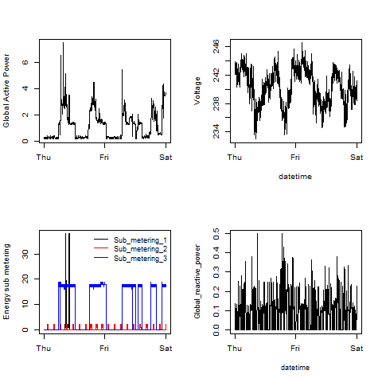

## Introduction

This assignment uses data from
the <a href="http://archive.ics.uci.edu/ml/">UC Irvine Machine
Learning Repository</a>, a popular repository for machine learning
datasets. In particular, we will be using the "Individual household
electric power consumption Data Set" which I have made available on
the course web site:

* <b>Dataset</b>: <a href="https://d396qusza40orc.cloudfront.net/exdata%2Fdata%2Fhousehold_power_consumption.zip">Electric power consumption</a> [20Mb]

* <b>Description</b>: Measurements of electric power consumption in
one household with a one-minute sampling rate over a period of almost
4 years. Different electrical quantities and some sub-metering values
are available.

The following descriptions of the 9 variables in the dataset are taken
from
the <a href="https://archive.ics.uci.edu/ml/datasets/Individual+household+electric+power+consumption">UCI
web site</a>:

<ol>
<li><b>Date</b>: Date in format dd/mm/yyyy </li>
<li><b>Time</b>: time in format hh:mm:ss </li>
<li><b>Global_active_power</b>: household global minute-averaged active power (in kilowatt) </li>
<li><b>Global_reactive_power</b>: household global minute-averaged reactive power (in kilowatt) </li>
<li><b>Voltage</b>: minute-averaged voltage (in volt) </li>
<li><b>Global_intensity</b>: household global minute-averaged current intensity (in ampere) </li>
<li><b>Sub_metering_1</b>: energy sub-metering No. 1 (in watt-hour of active energy). It corresponds to the kitchen, containing mainly a dishwasher, an oven and a microwave (hot plates are not electric but gas powered). </li>
<li><b>Sub_metering_2</b>: energy sub-metering No. 2 (in watt-hour of active energy). It corresponds to the laundry room, containing a washing-machine, a tumble-drier, a refrigerator and a light. </li>
<li><b>Sub_metering_3</b>: energy sub-metering No. 3 (in watt-hour of active energy). It corresponds to an electric water-heater and an air-conditioner.</li>
</ol>

## Loading the data

The following code is used in `plot1.R`, `plot2.R`, `plot3.R`, and `plot4.R` to download, load, and subset the data.

<!-- -->

	#download and extract file
	url <- "https://d396qusza40orc.cloudfront.net/exdata%2Fdata%2Fhousehold_power_consumption.zip"
	download.file(url, destfile = "./household_power_consumption.zip")
	unzip("household_power_consumption.zip")

	#load first five rows to get the classes of the variables
	top5 <- read.table("household_power_consumption.txt", header = TRUE, sep = ";", na.strings = "?", nrows = 5)
	classes <- sapply(top5, class)

	#read the entire dataset
	alldata <- read.table("household_power_consumption.txt", header = TRUE, sep = ";", na.strings = "?", colClasses = classes)

	#convert the date variable to a Date datatype
	alldata$Date <- as.Date(alldata$Date, "%d/%m/%Y")

	#We will only be using data from the dates 2007-02-01 and 2007-02-02
	subsetdata <- alldata[alldata$Date >= "2007-02-01" & alldata$Date <= "2007-02-02",]

	#convert the time field to a datetime
	subsetdata$Time <- as.POSIXct(paste(subsetdata$Date, strftime(strptime(subsetdata$Time, "%T"), "%T")), format = "%Y-%m-%d %T")
	colnames(subsetdata)[2] <- "datetime"

## Making Plots

### Plot 1

The following code is used in `plot1.R` to create `plot1.png`

<!-- -->

	  #create the plot and save it
	  png(filename = "plot1.png")
	  hist(subsetdata$Global_active_power, col = "red", main = "Global Active Power", xlab = "Global Active Power (kilowatts)")
	  dev.off()

 

### Plot 2
The following code is used in `plot2.R` to create `plot2.png`

<!-- -->

	#create the plot and save it
	png(filename = "plot2.png")
	with(subsetdata, plot(datetime, Global_active_power, type = "l", xlab = "", ylab = "Global Active Power (kilowatts)"))
	dev.off()

 

### Plot 3
The following code is used in `plot3.R` to create `plot3.png`

<!-- -->

	#create the plot and save it
	png(filename = "plot3.png")
	with(subsetdata, plot(datetime, Sub_metering_1, type = "l", xlab = "", ylab = "Energy sub metering"))
	with(subsetdata, lines(datetime, Sub_metering_2, col = "red"))
	with(subsetdata, lines(datetime, Sub_metering_3, col = "blue"))
	legend("topright", lty = c(1,1,1), col = c("black", "red", "blue"), legend = c("Sub_metering_1", "Sub_metering_2", "Sub_metering_3"))
	dev.off()
	
 

### Plot 4
The following code is used in `plot4.R` to create `plot4.png`

<!-- -->

	#create the plot and save it
	png(filename = "plot4.png")
	par(mfrow = c(2,2))
	with(subsetdata, plot(datetime, Global_active_power, type = "l", xlab = "", ylab = "Global Active Power"))
	with(subsetdata, plot(datetime, Voltage, type = "l"))
	with(subsetdata, plot(datetime, Sub_metering_1, type = "l", xlab = "", ylab = "Energy sub metering"))
	with(subsetdata, lines(datetime, Sub_metering_2, col = "red"))
	with(subsetdata, lines(datetime, Sub_metering_3, col = "blue"))
	legend("topright", bty = "n", cex=0.95, pt.cex=1, lty = c(1,1,1), col = c("black", "red", "blue"), legend = c("Sub_metering_1", "Sub_metering_2", "Sub_metering_3"))
	with(subsetdata, plot(datetime, Global_reactive_power, type = "l", cex.lab = .95))
	dev.off()

 

